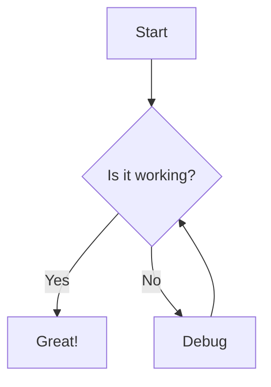

# md-viewport

[](https://www.npmjs.com/package/md-viewport)
[](https://opensource.org/licenses/ISC)

A lightweight CLI tool that renders Markdown files into rich, beautifully styled HTML pages in your browser. No live server needed—just instant, polished markdown previews.

## Features

- **GitHub Modern Styling** - Clean, professional design with light/dark mode support
- **GitHub Flavored Markdown** - Full GFM support including tables, task lists, and strikethrough
- **Syntax Highlighting** - Beautiful code blocks with Highlight.js
- **Math Rendering** - LaTeX math equations with KaTeX (inline `$...$` and block `$$...$$`)
- **Mermaid Diagrams** - Render flowcharts, sequence diagrams, and more
- **Auto Table of Contents** - Generated from headings with smooth scrolling
- **Copy Code Button** - One-click copying for code blocks
- **Self-Contained Output** - All styles and scripts inline, no dependencies
- **Auto Cleanup** - Temp files automatically deleted after viewing
- **Configurable** - Use `.mdvprc` for persistent preferences

## Installation

### Global Installation (Recommended)

```bash
npm install -g md-viewport
```

### Using npx (No Installation Required)

```bash
npx md-viewport README.md
```

### Local Development

```bash
git clone https://github.com/Showwaiyan/md-viewport.git
cd md-viewport
npm install
npm run build
npm link
```

## Usage

### Basic Usage

```bash
mdvp README.md
```

This will:

1. Convert your markdown to HTML
2. Apply beautiful GitHub Modern styling
3. Open it in your default browser
4. Auto-cleanup the temp file after 60 seconds

### CLI Options

```bash
mdvp <file> [options]

Options:
  -V, --version              output the version number
  -t, --theme <theme>        Theme: light, dark, or auto (default: "auto")
  --no-toc                   Disable table of contents
  --no-line-numbers          Disable line numbers in code blocks
  --no-copy-button           Disable copy button in code blocks
  --no-math                  Disable math rendering
  --no-mermaid               Disable Mermaid diagram rendering
  --no-syntax-highlight      Disable syntax highlighting
  --no-auto-cleanup          Disable automatic cleanup of temp files
  --cleanup-delay <ms>       Delay before cleaning up temp file (default: "60000")
  -h, --help                 display help for command
```

### Examples

```bash
# Force dark theme
mdvp README.md --theme dark

# Disable table of contents
mdvp README.md --no-toc

# Keep temp file (don't auto-delete)
mdvp README.md --no-auto-cleanup

# Custom cleanup delay (5 minutes)
mdvp README.md --cleanup-delay 300000
```

## Configuration File

Create a `.mdvprc` or `.mdvprc.json` file in your project root or home directory:

```json
{
  "theme": "dark",
  "toc": true,
  "lineNumbers": true,
  "copyButton": true,
  "math": true,
  "mermaid": true,
  "syntaxHighlight": true,
  "autoCleanup": true,
  "cleanupDelay": 60000
}
```

**Config File Priority:**

1. `./.mdvprc` (current directory)
2. `./.mdvprc.json` (current directory)
3. `~/.mdvprc` (home directory)
4. `~/.mdvprc.json` (home directory)

CLI options will override config file settings.

## Supported Markdown Features

### GitHub Flavored Markdown

- ✅ Tables
- ✅ Task lists
- ✅ Strikethrough
- ✅ Autolinks
- ✅ Emoji (via standard unicode)

### Code Blocks with Syntax Highlighting

````markdown
```javascript
function hello(name) {
  console.log(`Hello, ${name}!`);
}
```
````

### Math Equations

```markdown
Inline math: $E = mc^2$

Block math:

$$
\frac{-b \pm \sqrt{b^2 - 4ac}}{2a}
$$
```

### Mermaid Diagrams

````markdown

````

## How It Works

1. **Reads** your markdown file
2. **Parses** it with marked.js (GFM mode)
3. **Applies** syntax highlighting, math rendering, etc.
4. **Generates** a self-contained HTML file with all styles/scripts inline
5. **Writes** to a temp file (e.g., `/tmp/md-viewport-abc123.html`)
6. **Opens** it in your default browser
7. **Cleans up** the temp file after a delay (optional)

## Browser Support

Works with any modern browser:

- Chrome/Edge 90+
- Firefox 88+
- Safari 14+

## Programmatic Usage

You can also use `md-viewport` as a library in your Node.js projects:

```typescript
import { renderMarkdown, loadConfig } from "md-viewport";

const config = await loadConfig();
const html = await renderMarkdown("# Hello World", config, "My Document");
console.log(html);
```

## Development

```bash
# Clone the repository
git clone https://github.com/Showwaiyan/md-viewport.git
cd md-viewport

# Install dependencies
npm install

# Build
npm run build

# Watch mode (auto-rebuild on changes)
npm run dev

# Test locally
node dist/cli.js test.md
```

## Project Structure

```
md-viewport/
├── src/
│   ├── cli.ts              # CLI entry point
│   ├── renderer.ts         # Core markdown → HTML conversion
│   ├── types.ts            # TypeScript types
│   ├── plugins/
│   │   └── toc.ts         # Table of contents generator
│   └── utils/
│       ├── config.ts      # Config file loader
│       ├── file.ts        # File operations
│       └── browser.ts     # Browser launcher
├── dist/                   # Compiled JavaScript
├── package.json
├── tsconfig.json
└── README.md
```

## Contributing

Contributions are welcome! Please feel free to submit a Pull Request.

## License

MIT License - see [LICENSE](LICENSE) file for details.

## Author

Showwaiyan

## Roadmap

- [ ] Custom CSS themes support
- [ ] Export to PDF
- [ ] Watch mode for auto-refresh
- [ ] Plugin system
- [ ] More diagram types (PlantUML, Graphviz)
- [ ] Slide show mode

## Acknowledgments

- [marked](https://marked.js.org/) - Markdown parser
- [Highlight.js](https://highlightjs.org/) - Syntax highlighting
- [KaTeX](https://katex.org/) - Math rendering
- [Mermaid](https://mermaid.js.org/) - Diagrams
- GitHub for design inspiration
