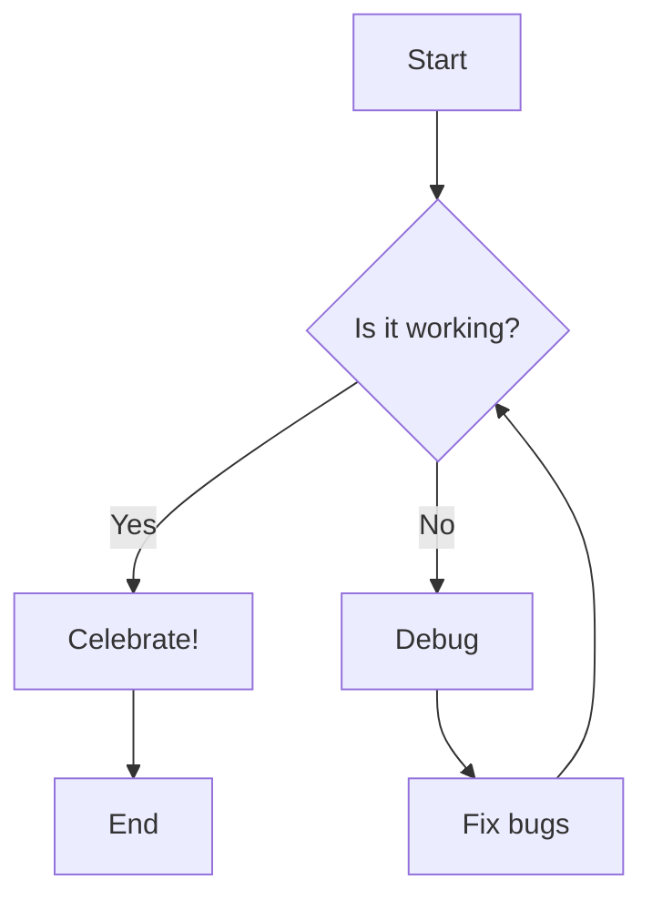
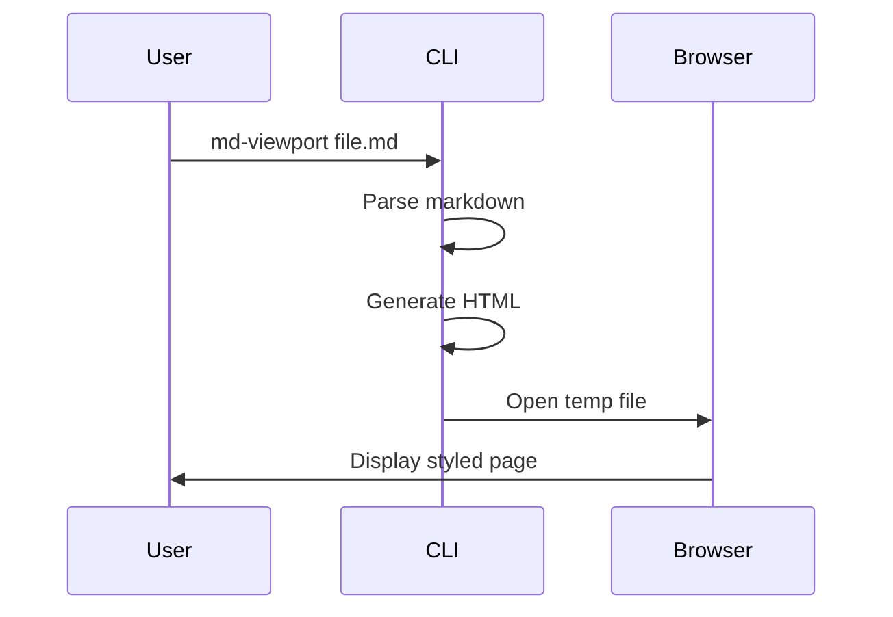

# md-viewport Demo

This is a demonstration of all the features supported by md-viewport.

## Introduction

Welcome to **md-viewport**! This tool converts Markdown files into beautifully styled HTML pages. It supports all the features you'd expect from a modern Markdown renderer.

## Text Formatting

You can use _italic_, **bold**, **_bold italic_**, ~~strikethrough~~, and `inline code`.

### Links and Images

Check out the [md-viewport repository](https://github.com/Showwaiyan/md-viewport) on GitHub.

## Lists

### Unordered List

- First item
- Second item
  - Nested item 1
  - Nested item 2
- Third item

### Ordered List

1. First step
2. Second step
3. Third step

### Task List

- [x] Set up the project
- [x] Implement core features
- [ ] Write documentation
- [ ] Publish to npm

## Code Blocks

### JavaScript

```javascript
function fibonacci(n) {
  if (n <= 1) return n;
  return fibonacci(n - 1) + fibonacci(n - 2);
}

console.log(fibonacci(10)); // 55
```

### Python

```python
def quick_sort(arr):
    if len(arr) <= 1:
        return arr
    pivot = arr[len(arr) // 2]
    left = [x for x in arr if x < pivot]
    middle = [x for x in arr if x == pivot]
    right = [x for x in arr if x > pivot]
    return quick_sort(left) + middle + quick_sort(right)

print(quick_sort([3, 6, 8, 10, 1, 2, 1]))
```

## Tables

| Feature             | Supported | Notes                 |
| ------------------- | --------- | --------------------- |
| GFM                 | ✅        | Full support          |
| Syntax Highlighting | ✅        | Via Highlight.js      |
| Math                | ✅        | Via KaTeX             |
| Mermaid             | ✅        | Client-side rendering |
| Auto TOC            | ✅        | From h2-h6            |

## Math Equations

### Inline Math

The quadratic formula is $x = \frac{-b \pm \sqrt{b^2 - 4ac}}{2a}$.

### Block Math

$$
\int_{-\infty}^{\infty} e^{-x^2} dx = \sqrt{\pi}
$$

$$
E = mc^2
$$

## Mermaid Diagrams

### Flowchart



### Sequence Diagram



## Blockquotes

> This is a blockquote. It can contain multiple paragraphs.
>
> Like this one. Blockquotes can also contain other Markdown elements.

## Horizontal Rule

---

## Advanced Features

### Nested Lists with Code

1. First, install the package:

   ```bash
   npm install -g md-viewport
   ```

2. Then run it on any markdown file:

   ```bash
   md-viewport README.md
   ```

3. Enjoy the beautiful output!

### Complex Table

| Language   | Paradigm       | Typing  | Year |
| ---------- | -------------- | ------- | ---- |
| JavaScript | Multi-paradigm | Dynamic | 1995 |
| Python     | Multi-paradigm | Dynamic | 1991 |
| Rust       | Multi-paradigm | Static  | 2010 |
| Go         | Procedural     | Static  | 2009 |

## Conclusion

**md-viewport** makes it easy to preview your Markdown files with professional styling. Try it out today!

Visit the [GitHub repository](https://github.com/Showwaiyan/md-viewport) for more information.
